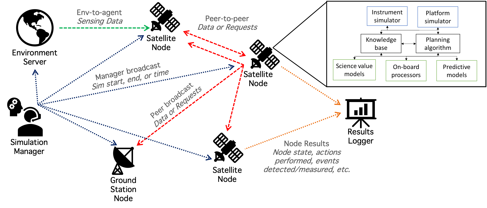

#   3D-CHESS: Decentralized, Distributed, Dynamic, and Context-aware Heterogeneous Sensor Systems

This application simulates a distributed sensor web Earth-Observation system described in the
3D-CHESS project which aims to demonstrate a new Earth
observing strategy based on a context-aware Earth observing
sensor web. This sensor web consists of a set of nodes with a
knowledge base, heterogeneous sensors, edge computing,
and autonomous decision-making capabilities. Context
awareness is defined as the ability for the nodes to gather,
exchange, and leverage contextual information (e.g., state of
the Earth system, state and capabilities of itself and of other
nodes in the network, and how those states relate to the dy-
namic mission objectives) to improve decision making and
planning. The current goal of the project is to demonstrate
proof of concept by comparing the performance of a 3D-
CHESS sensor web with that of status quo architectures in
the context of a multi-sensor inland hydrologic and ecologic
monitoring system.

## Generalized Scenario Description:

- The simulation environment creates an initial population of tasks and announces them to the ground station agents.
- Ground Station agents broadcast new tasks to all agents
- Satellite and UAV agents receive the task broadcasts and perform a task-assignment procedure using MACCBBA
- The environment may stochastically generate new tasks throughout the simulation and announce them to Ground Station Agents (PENDING)
- 

#
## Simulation Element Description
## Manager:
In charge of keeping time in the simulation. 
- Listens for all agents to request a time to fast-forward to. 
- Once all agents have done so, the manager will perform a time-step increase in the simulation clock and announce the new time to every member of the simulation. 
- This will be repeated until the final time has been reached.

## Monitor:
Currently

## Environment:
The simulation environment is in charge of outlining the space in which the agents will live during the simulation. The environment also tracks the position of each agent and the state of each measurement task. 

It may create new tasks and publish them to the agents and it may also inform agents that they are no longer in range of one and other and thus are unable to communicate until they are back in range. This range is defined within the environment. 

## Agent:

Agents exist in a 2D environment with defined borders. They may move in any direction within said 2D space at a fixed speed. Agents may also perform measurement tasks if they possess the proper insturments and share information with other agents. 
    
Tasks do NOT require collaboration between agents in this example. 

Agent's physical limitations beyond their travel speed and instruments are not considered in this example.

### Agent State:
Tracks the position and velocity vector of the agent, a list of tasks performed by the agent, and the current status of the agent at a given time. The status of an agent may be idling, traveling, or performing a measurement.

Agents are responsible of tracking their own state and publishing it to the environment and monitor at each time-step. 

### Agent Architecture:
Agents consist of a main `live()` process and a planning module.

At the beginning of each time-step, the agent's `live()` process will listen for any environment message. If this message instructs the agent to alter its connectivity to other agents, it will do so by unsubscribing or subscribing to the PUB port of the desired agent.

Once this environment message is handled, the agent's `live()` process will listen for any incoming messages from either its internal planning module or any external simulation elements.

All messages from other agents will be forwarded to the planning module. Messages from the internal planning module contain actions which the agent will perform as soon as these messages are received. If a clock update message from the simulation manager is received, it will update its clock with the newly announced time and will repeat this this procedure until the agent receives an end-of-simulation message from the environment. 

Agents update their state at the beginning of each time-step as well as before and after an action is performed.

#
## Planners
The internal planning module within each agents is in charge of instructing the agent on which actions to perform. 

When planning, this module waits for messages from the environment announcing new tasks to perform or for messages from other agents informing of the status of their plans. to perform the tasks being announced and schedules tasks to be performed by its parent agent given this information. 

Different planning strategies are to be tested with this platform. All of the using the utility function:

    U(x,i,t) = R * exp( (t - t_start) * urgency ) - C

This utility function returns a value of 0 if:
- The agent is not in the same position as the task at the time of measurement.
- The agent does not pocess the instrument required for the measurement. 
- The time of measurement `t` is not within the interval `(t_start, t_end)`.

`C` represents a fixed cost of performing a task. 

### Measurement Task Description:
Measurement Tasks are defined by a tuple containing their:
1. Location
2. Reward
3. Start Time
4. End Time
6. Instrument
7. Task ID

This information will be shared to and amongst agents as `TaskRequest` messages. 

### Asynchronous Consensus-Based Bundle Algorithm - ACBBA 

#
## Running this example
Open a terminal in this directory and run `main.py` by entering the following command:

    python main.py