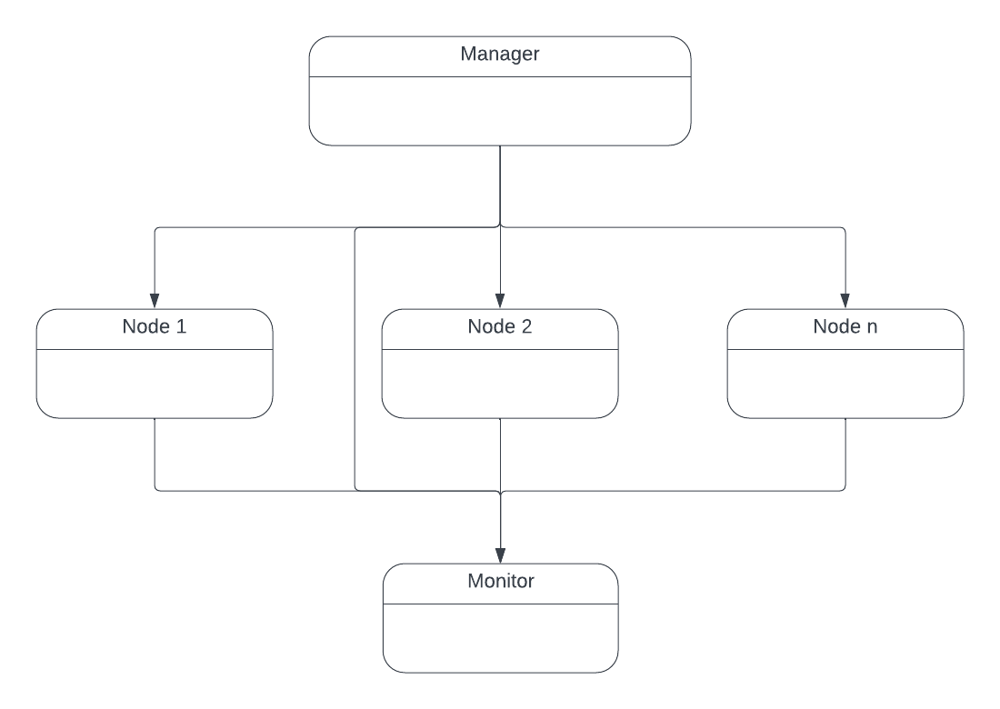

# User Guide

## Overview
The DMAS library contains the basic building blocks for a multiagent simulation platform. 
____
## Network Framework 
At its most fundamental state, DMAS is a high-level inter-process communication framework that can be moderated by a simulation manager process and monitored by a separate simulation monitor process.

Any processes that is part of the simulation may be run on the same or separate computing units as long as all processes have network access to every other process in the network. This may be done through local networks or through other networks.

*
DMAS network framework
*

### Network Manager

### Network Nodes

### Network Monitor

____
## Simulation Framework

### Manager

### Monitor

### Environment

### Agents

### Internal Modules

## Getting Started
See `applications` directory for examples. 

## Class Diagrams
See [UML class diagrams](https://lucid.app/lucidchart/450dde3a-dedb-4a30-a2cc-6d1c82c858bb/edit?invitationId=inv_78959986-9311-4757-8a6e-da1f3c03c2c3&page=0_0#) for more details on class hierarchy.